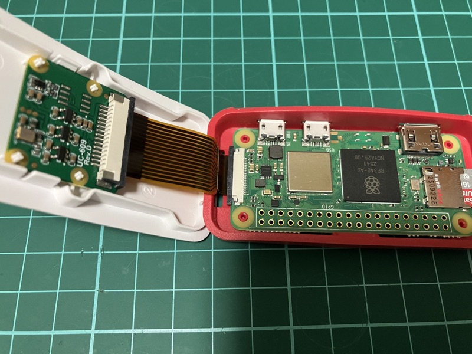

# Raspberry Pi カメラストリーミングサーバー

Raspberry Pi Zero 2 W + Arducam IMX219カメラを使用したMJPEGストリーミングサーバー

## ハードウェア構成

### Raspberry Pi Zero 2 W

- OS: Raspberry Pi OS Lite (Trixie)
- カメラ: Arducam IMX219 (8MP, Sony IMX219センサー)
- 接続: Wi-Fi経由でネットワーク接続

## セットアップ

### Raspberry Pi Zero 2 W側

#### 1. カメラの接続

##### Arducamカメラをカメラポート(CSI)に接続



#### 2. カメラ設定

`/boot/firmware/config.txt`を編集

```bash
sudo vi /boot/firmware/config.txt
```

差分

```diff
# Additional overlays and parameters are documented
# /boot/firmware/overlays/README

+ # imx219 setting
+ camera_auto_detect=0
+ dtoverlay=imx219

# Automatically load overlays for detected DSI displays
display_auto_detect=1
```

再起動

```bash
sudo reboot
```

[参考 「SOFTWARE SETTING」](https://blog.arducam.com/downloads/arducam_imx219_for_pi_start_guide.pdf)

#### 3. カメラ認識確認

```bash
rpicam-hello --list-cameras
```

Available camerasに、**`imx219`** が表示されることを確認

```
Available cameras
-----------------
0 : imx219 [3280x2464 10-bit RGGB] (/base/soc/i2c0mux/i2c@1/imx219@10)
    Modes: 'SRGGB10_CSI2P' : 640x480 [206.65 fps - (1000, 752)/1280x960 crop]
                             1640x1232 [41.85 fps - (0, 0)/3280x2464 crop]
                             1920x1080 [47.57 fps - (680, 692)/1920x1080 crop]
                             3280x2464 [21.19 fps - (0, 0)/3280x2464 crop]
           'SRGGB8' : 640x480 [206.65 fps - (1000, 752)/1280x960 crop]
                      1640x1232 [83.70 fps - (0, 0)/3280x2464 crop]
                      1920x1080 [47.57 fps - (680, 692)/1920x1080 crop]
                      3280x2464 [21.19 fps - (0, 0)/3280x2464 crop]
```

#### 4. Picamera2インストール

```bash
sudo apt update
sudo apt full-upgrade
sudo apt install -y python3-picamera2 --no-install-recommends
```

[参考 「2.2. Installation and updating」](https://pip-assets.raspberrypi.com/categories/652-raspberry-pi-camera-module-2/documents/RP-008156-DS-2-picamera2-manual.pdf?disposition=inline)

#### 5. ソースコードの配置と起動

##### 5-1. ~/Cameraフォルダを作成（Raspberry Pi側）

```bash
mkdir ~/Camera
```

##### 5-2. Makefileの設定（開発機側）

`.make/Makefile` の `RASPI_HOST`・`RASPI_USER` を環境に合わせて編集
（詳細は「開発環境 > Makefile」セクション参照）

##### 5-3. ソースコードのアップロード（開発機側）

```bash
make -C .make upload
```

##### 5-4. ストリーミングサーバー起動（Raspberry Pi側）

```bash
cd ~/Camera
python src/streaming_server.py
```

ブラウザで`http://<RASPI_HOST>:8000/stream.mjpg`にアクセスして映像確認

## 開発環境

### Makefile

#### 概要

`.make/Makefile`は、PCとRaspberry Pi間のファイル同期を自動化するためのツールです。rsyncを使用して差分転送を行います。

#### Makefileの内容

```makefile
RASPI_HOST = raspberrypi
RASPI_USER = pi
LOCAL_DIR = ..
REMOTE_DIR = ~/Camera

EXCLUDE_OPTS = --exclude '.make' --exclude '.git' --exclude '.gitignore' --exclude '.DS_Store' --exclude '__pycache__' --exclude '*.pyc'

.PHONY: download upload help

help:
	@echo "使い方:"
	@echo "  make -C .make download  - Raspberry Piからファイルをダウンロード"
	@echo "  make -C .make upload    - Raspberry Piにファイルをアップロード"

download:
	rsync -avz $(RASPI_USER)@$(RASPI_HOST):$(REMOTE_DIR)/ $(LOCAL_DIR)/

upload:
	rsync -avz $(EXCLUDE_OPTS) $(LOCAL_DIR)/ $(RASPI_USER)@$(RASPI_HOST):$(REMOTE_DIR)/
```

## 技術仕様

### ストリーミング方式

- プロトコル: HTTP
- フォーマット: MJPEG (Motion JPEG)
- 解像度: 640x480 (デフォルト)
- フレームレート: 約30fps

### アクセス方法

#### ブラウザ

```
http://<RASPI_HOST>:8000/stream.mjpg
```

#### HTMLに埋め込み

```html
:8000/stream.mjpg" />
```

#### Python(OpenCV)

```python
import cv2
cap = cv2.VideoCapture('http://<RASPI_HOST>:8000/stream.mjpg')

while True:
    ret, frame = cap.read()
    if ret:
        # フレーム処理
        cv2.imshow('Camera', frame)
    if cv2.waitKey(1) & 0xFF == ord('q'):
        break

cap.release()
cv2.destroyAllWindows()
```

## 参考資料

- [Picamera2公式ドキュメント](https://datasheets.raspberrypi.com/camera/picamera2-manual.pdf)
- [Picamera2 GitHubリポジトリ](https://github.com/raspberrypi/picamera2)
- [MJPEGサーバーサンプル](https://github.com/raspberrypi/picamera2/blob/main/examples/mjpeg_server.py)
- [Arducam IMX219製品情報](https://www.arducam.com/90524.html)
- [MJPEG Streaming Protocol](https://en.wikipedia.org/wiki/Motion_JPEG)
